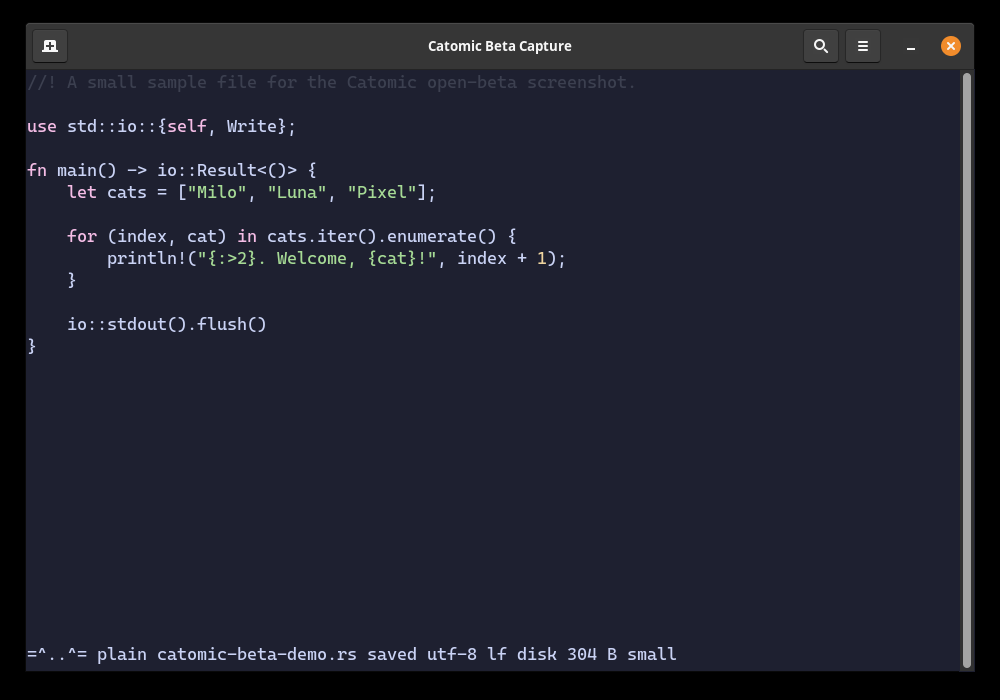

# Catomic

[](https://github.com/maelguimet/catomic/actions/workflows/ci.yml)

Catomic is a Linux-first, modeless terminal text editor: Nano that is not afraid
of useful shortcuts. It aims to be fast, obvious, keyboard-friendly, and hard to
accidentally destroy work with—without turning into a terminal IDE by default.

Catomic is entering open beta. Back up important files and read the
[file-semantics limitations](#limitations) before making it your only editor.



## Highlights

- Familiar editing: selection, mouse input, search/replace, goto line,
  undo/redo, multiple buffers, and GUI-style shortcuts.
- Unicode-aware cursor movement and terminal layout, including grapheme
  clusters, wide characters, emoji sequences, and tabs.
- Editable large-file pages that avoid loading an oversized file into one
  in-memory string.
- Atomic saves, external-change detection, explicit overwrite confirmation, and
  opt-in `.catnap` recovery.
- Viewport-bounded highlighting for Markdown, Rust, Python, and JSON, plus a
  read-only Markdown preview.
- An opt-in Project mode for explicit file discovery, linting, diagnostics, and
  cached path completion. Plain mode does not scan a repository or start project
  services.
- Explicit, preview-first LLM commands. Catomic does not construct a model
  client or send context until you invoke a command and confirm the destination
  and context.

## Install from source

Catomic currently targets Linux and stable Rust. Clone the repository, then
build an optimized binary:

```sh
git clone https://github.com/maelguimet/catomic.git
cd catomic
cargo build --release --locked
./target/release/catomic
```

To install `catomic` into Cargo's binary directory instead:

```sh
cargo install --path . --locked
```

## Start editing

Open one or more files, or start with an untitled buffer:

```sh
catomic notes.md
catomic notes.txt todo.txt server.log
catomic
```

Run `catomic --help` for command-line usage. Inside the editor, press `Ctrl+H`
or `F1` for the complete built-in shortcut reference.
For installation, editing workflows, configuration, safety behavior, and
troubleshooting, see the [complete user guide](docs/user-guide.md).

### Essential shortcuts

| Action | Shortcut |
| --- | --- |
| Save / Save As | `Ctrl+S` / `Ctrl+Shift+S` |
| Open / new / close buffer | `Ctrl+O` / `Ctrl+N` / `Ctrl+W` |
| Previous / next buffer | `Alt+PageUp` / `Alt+PageDown` |
| Undo / redo | `Ctrl+Z` / `Ctrl+Y` |
| Find / replace / goto line | `Ctrl+F` / `Ctrl+Shift+F` / `Ctrl+G` |
| Select / copy / cut / paste | `Ctrl+A` / `Ctrl+C` / `Ctrl+X` / `Ctrl+V` |
| Local completion | `Ctrl+Space` |
| Command prompt | `Ctrl+Shift+P` or `F2` |
| Markdown preview | `F6` |
| Line numbers / whitespace / soft wrap | `F7` / `F8` / `F9` |
| Previous / next large-file page | `Ctrl+PageUp` / `Ctrl+PageDown` |
| Quit | `Ctrl+Q` |

Terminal emulators and multiplexers can intercept or rewrite some key chords.
Bracketed paste is inserted as one undoable edit; Catomic also has an internal
clipboard and sends copied text through OSC 52 when the terminal supports it.

### Essential prompt commands

Open the prompt with `Ctrl+Shift+P` or `F2`. Enter these commands without a
leading `:`.

| Command | Purpose |
| --- | --- |
| `open PATH`, `new`, `close`, `close!` | Manage buffers; `close!` drops edits |
| `save`, `save as PATH` | Save the active buffer |
| `goto LINE`, `replace`, `replace-all` | Navigate and edit |
| `project`, `plain` | Enter or leave opt-in Project mode |
| `files`, `lint`, `diagnostics`, `dnext`, `dprev` | Run Project tools |
| `run NAME` | Run a configured, trusted external command |
| `recover` | Preview and apply a newer `.catnap` sidecar |
| `meow TEXT`, `bigmeow TEXT` | Ask a model about this file or selection |
| `gitmeow TEXT`, `megameow TEXT` | Ask a model using repository context |

## Configuration

Catomic reads TOML from `$XDG_CONFIG_HOME/catomic/config.toml` or
`~/.config/catomic/config.toml`. No configuration file is required. This example
shows the most common settings:

```toml
[editor]
tab_size = 4

[big_files]
page_lines = 20000

[files]
auto_reload = true

[cat]
status_messages = true

[recovery]
enabled = false
interval_secs = 30
max_bytes = 1048576

[languages.rs]
tab_size = 4
linter = "cargo check --message-format short {file}"

[llm]
base_url = "http://127.0.0.1:8080/v1"
model = "local-model"
api_key_env = "OPENAI_API_KEY"
timeout_secs = 120
```

Recovery is disabled by default. Named commands and hooks invoke `/bin/sh -c`
and are trusted user configuration; their input, output, and runtime are
bounded, but the command itself can have effects outside Catomic.

LLM endpoints use an OpenAI-compatible API. Model actions show the endpoint,
model, and exact context extent before sending; edits then open read-only and
require a second confirmation before becoming one undoable buffer change.
Plain HTTP is allowed for loopback models and unauthenticated LAN models. If an
API key is present, Catomic refuses to send it over non-loopback HTTP; use HTTPS
for authenticated remote endpoints. See
[the LLM safety rules](docs/llm-rules.md) for the full boundary.

## Limitations

- Linux terminals are the supported platform for this beta. Windows and macOS
  are not first-class targets yet.
- Editor sessions require a UTF-8 locale, and files must contain valid UTF-8.
  UTF-16 and arbitrary byte-oriented files are refused.
- Ordinary buffers preserve UTF-8 BOMs and LF, CRLF, or CR line endings. Paged
  large files support LF and CRLF; BOM-prefixed or CR-only files must remain
  below the paging threshold.
- Atomic save replaces the destination inode. On Linux, Catomic preserves mode,
  owner, and group, but refuses files with multiple hard links or any extended
  attributes/ACLs rather than silently discarding those semantics. Save As also
  refuses FIFOs, sockets, directories, and symlinks resolving to them. Use
  another tool for a refused target.
- Terminal clipboard behavior depends on the emulator. Some environments
  intercept `Ctrl`/`Ctrl+Shift` chords or do not support OSC 52.
- Syntax highlighting is deliberately lexical and viewport-only. Catomic does
  not provide tree-sitter, a full LSP client, split views, or a plugin ABI.
- LLM edits are limited to the confirmed active file. Wide multi-file proposals
  and `:feralmeow` are not implemented.

If Catomic crashes, corrupts content, or behaves differently on a particular
filesystem, please use the [bug report form](https://github.com/maelguimet/catomic/issues/new?template=bug_report.yml).
Security-sensitive findings should follow [SECURITY.md](SECURITY.md).

## Project documentation

- [User guide](docs/user-guide.md)
- [Contributing](CONTRIBUTING.md)
- [Architecture and development boundaries](docs/architecture.md)
- [Design decisions](docs/decisions/)
- [Performance discipline and measurements](docs/performance.md)
- [LLM safety rules](docs/llm-rules.md)
- [Roadmap, research, and design history](TODO.md)
- [v0.1 acceptance record](docs/v0.1-acceptance.md)

## License

Catomic is available under either the [MIT License](LICENSE-MIT) or the
[Apache License 2.0](LICENSE-APACHE), at your option.
